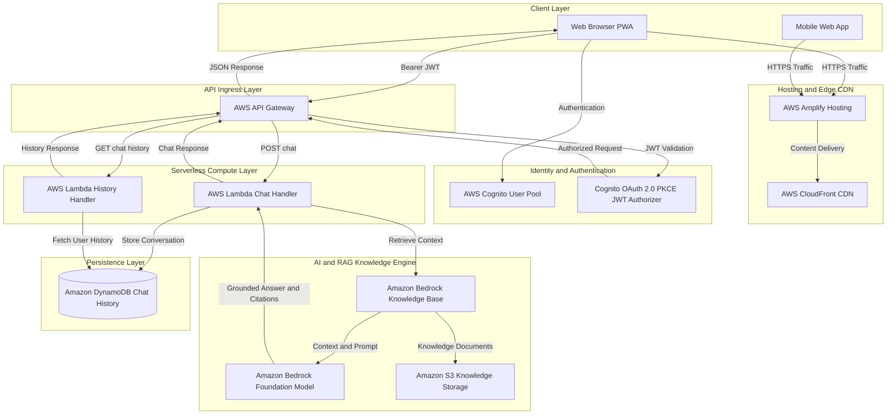
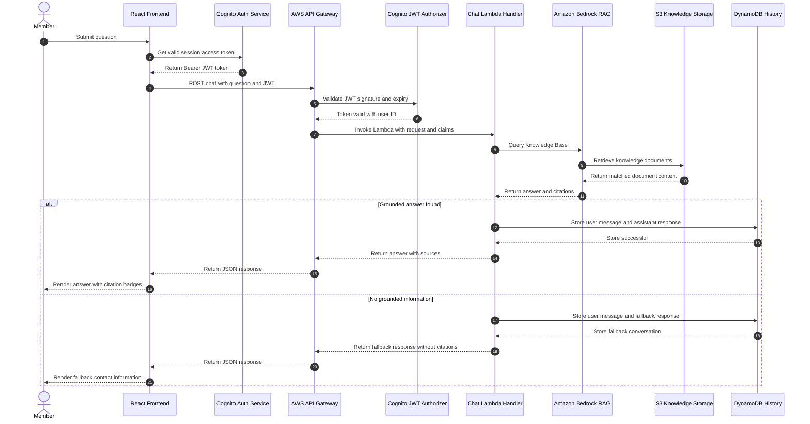
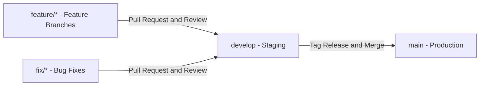

# ⚡ NIMBUS Student & Club Member Portal

[](https://aws.amazon.com/amplify/)
[](https://aws.amazon.com/bedrock/)
[](https://aws.amazon.com/cognito/)
[](https://vitejs.dev/)
[](https://react.dev/)
[](https://www.typescriptlang.org/)
[](https://tailwindcss.com/)
[](https://railway.app/)

NIMBUS is an enterprise-grade AI-powered Student & Club Member Portal built on AWS Serverless architecture and Amazon Bedrock Retrieval-Augmented Generation (RAG). It provides intelligent, grounded answers to university and club member queries backed by verified knowledge base documents stored in S3, while maintaining session history, secure PKCE authentication via AWS Cognito, and instant responses via API Gateway and Lambda.

---

## 📋 Table of Contents

- [High-Level Design (HLD)](#-high-level-design-hld)
- [Low-Level Design (LLD)](#-low-level-design-lld)
- [System Architecture & Workflow](#-system-architecture--workflow)
- [Key Features & Highlights](#-key-features--highlights)
- [Git Branching & Workflow Strategy](#-git-branching--workflow-strategy)
- [API Contracts & JSON Examples](#-api-contracts--json-examples)
- [Database Schema & Platform ID Design](#-database-schema--platform-id-design)
- [Production Database Migrations](#-production-database-migrations)
- [Step-by-Step Railway Deployment Guide](#-step-by-step-railway-deployment-guide)
- [GitHub Actions CI/CD Pipeline & Secrets](#-github-actions-cicd-pipeline--secrets)
- [Security & Production Hardening](#-security--production-hardening)
- [Troubleshooting & Diagnostic Matrix](#-troubleshooting--diagnostic-matrix)
- [Deployment Rollbacks & Log Auditing](#-deployment-rollbacks--log-auditing)
- [Local Setup Guide (NPM)](#-local-setup-guide-npm)

---

## 🏗 High-Level Design (HLD)

The High-Level Design showcases the global system architecture, client interfaces, authentication boundary, API Gateway route layer, serverless compute, Amazon Bedrock Knowledge Base RAG pipeline, and DynamoDB persistent storage.



---

## 🔍 Low-Level Design (LLD)

The Low-Level Design details the end-to-end component interaction sequence during an authenticated user session, query submission, RAG document retrieval, fallback evaluation, citation parsing, and state persistence.



---

## ⚙ System Architecture & Workflow

1. **Single Page Application (SPA) & PWA**: Built with Vite, React 18, and Tailwind CSS. Features full Progressive Web App (PWA) manifest support for offline fallback cards and home screen installation.
2. **Identity & Access Management**: Fully integrated with AWS Cognito User Pools. Supports user registration, email verification code flows, password reset, and session storage.
3. **API Routing**: AWS API Gateway REST API with CORS enabled and Amazon Cognito Authorizer protecting private endpoints.
4. **Retrieval-Augmented Generation (RAG)**: Amazon Bedrock Knowledge Base ingests markdown/PDF documentation from S3 buckets. Upon receiving a member prompt, Bedrock performs semantic vector search over document chunks and constructs a grounded prompt for LLM inference.
5. **Session & History Storage**: Chat history is persisted in Amazon DynamoDB with single-table design (`nimbus_chat_history`), enabling member chat state restoration across devices.

---

## ✨ Key Features & Highlights

- **Authenticated Chat Assistant**: Interactive AI assistant restricted to authenticated club members.
- **Dynamic Source Citations**: Extracts exact document names, sections, and snippets from Bedrock citations for full transparency.
- **Graceful Fallback Handling**: Automatically detects low-confidence responses and presents official club officer contact information.
- **Chat History Synchronization**: Instant retrieval of historical conversations via `GET /chat/history`.
- **Responsive Dark/Light Glassmorphism UI**: Built with modern Tailwind CSS aesthetics, responsive sidebar layout, and micro-animations.
- **PWA Ready**: Offline support banner and install prompt for desktop and mobile devices.

---

## 🌿 Git Branching & Workflow Strategy

NIMBUS follows a feature-branch workflow model for development, review, and deployment:



### Branch Names & Rules
- `main`: Production-ready branch. Pushing to `main` triggers automatic deployment to AWS Amplify and production Railway instances.
- `develop`: Staging and integration branch.
- `feature/*`: Dedicated feature development branches (e.g., `feature/chat-history`, `feature/pwa-install`).
- `fix/*`: Bug fixes and patch branches.
- `chore/*`: Maintenance, dependency updates, and git hygiene.

---

## 🔌 API Contracts & JSON Examples

### 1. Send Question (`POST /chat`)

#### Request Headers
```http
POST /chat HTTP/1.1
Host: 857hwv0wg2.execute-api.us-east-1.amazonaws.com
Content-Type: application/json
Authorization: Bearer eyJraWQiOiJ... (AWS Cognito JWT ID/Access Token)
```

#### Request Payload
```json
{
  "question": "What are the rules regarding project submission deadlines?"
}
```

#### Success Response (`200 OK`)
```json
{
  "conversationId": "conv_9823471029",
  "answer": "Project submissions must be finalized and uploaded to the official portal no later than 11:59 PM EST on the designated submission date. Late entries will incur a 10% point reduction per hour.",
  "sources": [
    {
      "file": "03-builder-center-publish.md",
      "section": "Submission Guidelines",
      "snippet": "All submissions must be uploaded prior to 11:59 PM EST..."
    }
  ],
  "is_fallback": false,
  "timestamp": "2026-08-13T10:15:00Z"
}
```

#### Fallback Response (`200 OK`)
```json
{
  "conversationId": "conv_9823471030",
  "answer": "",
  "sources": [],
  "is_fallback": true,
  "timestamp": "2026-08-13T10:16:00Z"
}
```

---

### 2. Fetch Chat History (`GET /chat/history`)

#### Request Headers
```http
GET /chat/history HTTP/1.1
Host: 857hwv0wg2.execute-api.us-east-1.amazonaws.com
Authorization: Bearer eyJraWQiOiJ...
```

#### Success Response (`200 OK`)
```json
{
  "history": [
    {
      "conversationId": "conv_9823471029",
      "sender": "user",
      "message": "What are the rules regarding project submission deadlines?",
      "timestamp": "2026-08-13T10:15:00Z"
    },
    {
      "conversationId": "conv_9823471029",
      "sender": "assistant",
      "message": "Project submissions must be finalized and uploaded...",
      "sources": [
        {
          "file": "03-builder-center-publish.md",
          "section": "Submission Guidelines",
          "snippet": "All submissions must be uploaded..."
        }
      ],
      "metadata": {
        "is_fallback": false
      },
      "timestamp": "2026-08-13T10:15:02Z"
    }
  ]
}
```

---

## 🗄 Database Schema & Platform ID Design

### DynamoDB Table: `nimbus_chat_history`

| Attribute Name | Data Type | Key Type | Description |
| :--- | :--- | :--- | :--- |
| `userId` | String (S) | **Partition Key (PK)** | Cognito User Sub (`sub` claim) |
| `timestamp` | String (S) | **Sort Key (SK)** | ISO-8601 Timestamp (`YYYY-MM-DDTHH:mm:ss.sssZ`) |
| `conversationId` | String (S) | Attribute / GSI PK | Unique Session UUID (`conv_XXXXXXXXXX`) |
| `sender` | String (S) | Attribute | `user` \| `assistant` |
| `message` | String (S) | Attribute | Raw question or model answer text |
| `citations` | List (L) | Attribute | Array of JSON objects detailing S3 source metadata |
| `isFallback` | Boolean (BOOL) | Attribute | `true` if answer triggered fallback card |

### Platform ID Format Standards
- **User ID**: `us-east-1:a1b2c3d4-e5f6-7a8b-9c0d-1e2f3a4b5c6d` (Cognito `sub`)
- **Conversation ID**: `conv_<timestamp_ms>_<random_hex>`
- **Message ID**: `msg_<timestamp_ms>_<random_alphanumeric>`

---

## 🚀 Production Database Migrations

For environment provisioning and DynamoDB table updates, AWS CLI / Infrastructure as Code scripts manage table states.

### DynamoDB Table Definition (AWS CLI Command)

```bash
aws dynamodb create-table \
    --table-name nimbus_chat_history \
    --attribute-definitions \
        AttributeName=userId,AttributeType=S \
        AttributeName=timestamp,AttributeType=S \
    --key-schema \
        AttributeName=userId,KeyType=HASH \
        AttributeName=timestamp,KeyType=RANGE \
    --billing-mode PAY_PER_REQUEST \
    --region us-east-1
```

---

## 🚂 Step-by-Step Railway Deployment Guide

Railway hosts the static build output or Node.js web server for the NIMBUS application.

### Step 1: Connect Repository to Railway
1. Log into [Railway.app](https://railway.app/).
2. Click **New Project** -> **Deploy from GitHub repo**.
3. Select `sameershaik-07/NIMBUS_HACKATHON`.

### Step 2: Configure Root & Build Commands
In Railway Project Settings:
- **Root Directory**: `frontend`
- **Build Command**: `npm ci && npm run build`
- **Start Command**: `npx serve -s dist -l $PORT`

### Step 3: Set Environment Variables
Navigate to the **Variables** tab in Railway and add:

```env
VITE_AWS_REGION=your-region
VITE_COGNITO_USER_POOL_ID=your-user-pool-id
VITE_COGNITO_CLIENT_ID=your-client-id
VITE_COGNITO_AUTHORITY=https://cognito-idp.your-region.amazonaws.com/your-user-pool-id
VITE_COGNITO_REDIRECT_URI=http://localhost:5173/auth/callback
VITE_COGNITO_LOGOUT_URI=http://localhost:5173/
VITE_COGNITO_DOMAIN=https://your-domain.auth.your-region.amazoncognito.com
VITE_API_BASE_URL=https://your-api-gateway-id.execute-api.your-region.amazonaws.com
```

---

## 🔄 GitHub Actions CI/CD Pipeline & Secrets

The repository includes an automated GitHub Actions workflow (`.github/workflows/deploy.yml`) for building, linting, and verifying frontend builds.

```yaml
name: NIMBUS CI/CD Deployment

on:
  push:
    branches: [ main ]
  pull_request:
    branches: [ main ]

jobs:
  build-and-test:
    runs-on: ubuntu-latest
    defaults:
      run:
        working-directory: ./frontend
    steps:
      - name: Checkout Source Code
        uses: actions/checkout@v4

      - name: Setup Node.js Environment
        uses: actions/setup-node@v4
        with:
          node-version: '20'
          cache: 'npm'
          cache-dependency-path: frontend/package-lock.json

      - name: Install Dependencies
        run: npm ci

      - name: Verify TypeScript & Build Artifacts
        run: npm run build
        env:
          VITE_AWS_REGION: ${{ secrets.VITE_AWS_REGION }}
          VITE_COGNITO_USER_POOL_ID: ${{ secrets.VITE_COGNITO_USER_POOL_ID }}
          VITE_COGNITO_CLIENT_ID: ${{ secrets.VITE_COGNITO_CLIENT_ID }}
          VITE_API_BASE_URL: ${{ secrets.VITE_API_BASE_URL }}
```

### Required Repository Secrets
Set these in **GitHub Settings -> Secrets and variables -> Actions**:
- `VITE_AWS_REGION`
- `VITE_COGNITO_USER_POOL_ID`
- `VITE_COGNITO_CLIENT_ID`
- `VITE_COGNITO_AUTHORITY`
- `VITE_COGNITO_DOMAIN`
- `VITE_API_BASE_URL`

---

## 🛡 Security & Production Hardening

1. **OAuth 2.0 PKCE Protection**: Authentication tokens are requested via Authorization Code Flow with PKCE (Proof Key for Code Exchange) to prevent code interception attacks.
2. **CORS Policy Hardening**: API Gateway restricts allowed origin headers exclusively to verified production domains.
3. **Repository Hygiene**: Local `.env` files, `node_modules/`, and `dist/` builds are explicitly excluded from Git tracking via `.gitignore`.
4. **Least Privilege IAM Policies**: Lambda execution roles are strictly scope-bound to query specific Bedrock Knowledge Bases and read/write to `nimbus_chat_history` DynamoDB table.

---

## 💡 Troubleshooting & Diagnostic Matrix

| Issue Description | Potential Cause | Resolution Steps |
| :--- | :--- | :--- |
| **`401 Unauthorized` on `/chat`** | Expired or missing Cognito JWT Access/ID Token. | Sign out of portal and re-authenticate to refresh session tokens in `localStorage`. |
| **`403 Forbidden` on API Gateway** | CORS misconfiguration or missing Bearer prefix in header. | Verify header format: `Authorization: Bearer <token>`. Check API Gateway CORS settings. |
| **Citations Missing in UI** | Bedrock returned unparsed S3 URIs or raw array. | Handled automatically by `normalizeSources()` in `src/services/api.ts`. |
| **PWA Install Prompt Not Displaying** | HTTPS required or browser lacks PWA criteria. | Ensure site is served over HTTPS and `manifest.webmanifest` is loaded. |
| **Build Failure during `npm ci`** | Out-of-sync `package-lock.json`. | Run `npm install` locally, update `package-lock.json`, and push changes. |

---

## ⏪ Deployment Rollbacks & Log Auditing

### Rolling Back AWS Amplify Deployment
1. Open **AWS Amplify Console**.
2. Navigate to **App Settings -> Build history**.
3. Select previous successful build commit.
4. Click **Redeploy this version**.

### Log Auditing via CloudWatch
To inspect API Gateway and Lambda execution logs:

```bash
# View live tail logs for Chat Lambda Function
aws logs tail /aws/lambda/nimbus-chat-handler --follow --region us-east-1
```

---

## 💻 Local Setup Guide (NPM)

### Prerequisites
- **Node.js**: v18.x or v20.x (LTS)
- **npm**: v9.x or v10.x

### Step-by-Step Setup

```bash
# 1. Clone the repository
git clone https://github.com/sameershaik-07/NIMBUS_HACKATHON.git

# 2. Change directory into the frontend folder
cd NIMBUS_HACKATHON/frontend

# 3. Install project dependencies using exact lockfile
npm ci

# 4. Create your local environment file (.env)
cat <<EOT > .env
VITE_AWS_REGION=your-region
VITE_COGNITO_USER_POOL_ID=your-user-pool-id
VITE_COGNITO_CLIENT_ID=your-client-id
VITE_COGNITO_AUTHORITY=https://cognito-idp.your-region.amazonaws.com/your-user-pool-id
VITE_COGNITO_REDIRECT_URI=http://localhost:5173/auth/callback
VITE_COGNITO_LOGOUT_URI=http://localhost:5173/
VITE_COGNITO_DOMAIN=https://your-domain.auth.your-region.amazoncognito.com
VITE_API_BASE_URL=https://your-api-gateway-id.execute-api.your-region.amazonaws.com
EOT

# 5. Start the Vite development server
npm run dev
```

After starting the server, open your browser and navigate to:
`http://localhost:5173`

### Available NPM Scripts

| Script | Command | Description |
| :--- | :--- | :--- |
| `npm run dev` | `vite` | Starts local Vite development server with Hot Module Replacement (HMR). |
| `npm run build` | `tsc -b && vite build` | Compiles TypeScript and generates production distribution artifacts in `dist/`. |
| `npm run preview` | `vite preview` | Locally previews the production build output from `dist/`. |
| `npm ci` | `npm ci` | Clean installs exact node_modules dependencies matching `package-lock.json`. |
